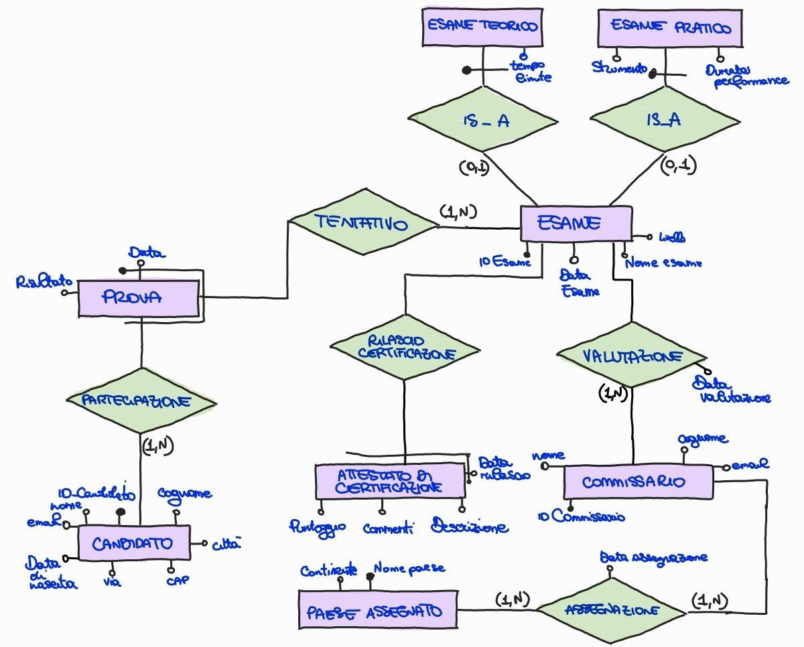

# Music School Certification System

Un sistema gestionale avanzato progettato per una **Scuola di Musica Certificatrice** che opera su scala internazionale. Il progetto copre l'intero ciclo di vita delle certificazioni: dalla modellazione concettuale alla gestione delle prove pratiche e teoriche, fino all'interrogazione dei dati tramite SQL avanzato.
*Progetto sviluppato nell'ambito del corso di Basi di Dati all'Università degli Studi di Salerno per il corso di Informatica.
*Realizzato da: **Sara Di Tella**.

---

## Panoramica del Progetto

Il sistema modella un ente che sviluppa curriculum musicali riconosciuti internazionalmente. Le certificazioni includono diverse categorie come **pianoforte, chitarra, canto, violino** e materie teoriche come **pedagogia e composizione**.

Il database gestisce:
- L'iscrizione dei candidati provenienti da diversi Paesi.
- L'assegnazione dei commissari alle sedi internazionali.
- La cronologia dettagliata di ogni tentativo d'esame.

---

## Architettura del Sistema

### Modellazione Concettuale (E-R)
Il cuore della progettazione è lo **Schema Entità-Relazione**, che utilizza la **reificazione** per gestire la relazione tra candidati, prove ed esami, consentendo il tracciamento di tentativi multipli.





#### Regole di Business principali:
- **Tentativi**: Un candidato può tentare più volte lo stesso esame in date diverse per migliorare il punteggio.
- **Specializzazione (ISA)**: Gli esami sono suddivisi in **Pratici** (con attributi specifici come strumento e durata performance) e **Teorici** (con tempo limite).
- **Partecipazione**: Un candidato non può iscriversi alla stessa categoria di esame nella stessa data.
- **Valutazione**: Ogni esame può essere valutato da più commissari, registrando la data specifica della valutazione.


## Implementazione Tecnica

### Schema Relazionale
Il database è stato normalizzato e implementato in **MySQL**. Sono stati applicati vincoli di integrità referenziale `ON UPDATE CASCADE` e `ON DELETE CASCADE` per garantire la coerenza tra le tabelle, come nel caso del legame tra commissari ed esami.
```sql
CREATE TABLE Esame (
    IDEsame CHAR(5) PRIMARY KEY,
    DataEsame DATE NOT NULL,
    NomeEsame VARCHAR(30) NOT NULL,
    Livello VARCHAR(20) NOT NULL,
    IDCommissario CHAR(5) NOT NULL,
    FOREIGN KEY (IDCommissario) REFERENCES Commissario(IDCommissario) 
    ON UPDATE CASCADE ON DELETE CASCADE
);
